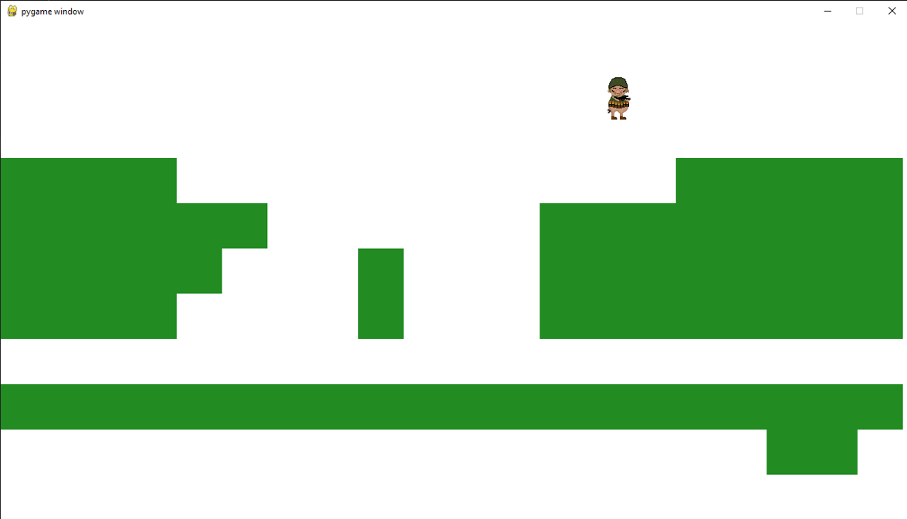
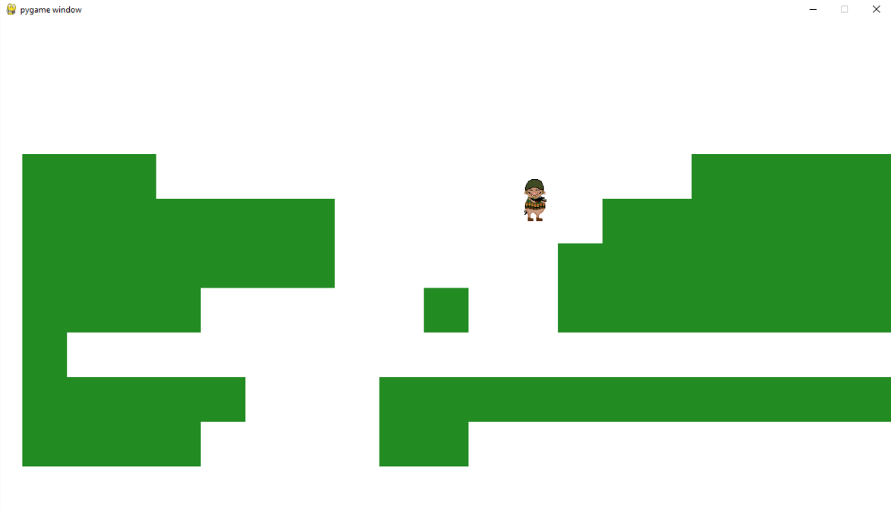
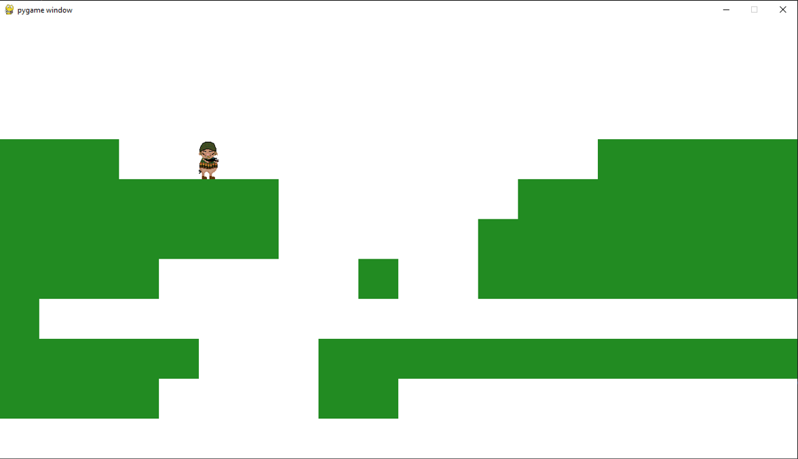

# Platformer

A quick basic platformer game demo that I made to try and learn more about coding collisions, gravity and camera control in PyGame.
To run the game simple run the peli.py file on your computer.
The character is controlled with the arrow keys and space bar.

